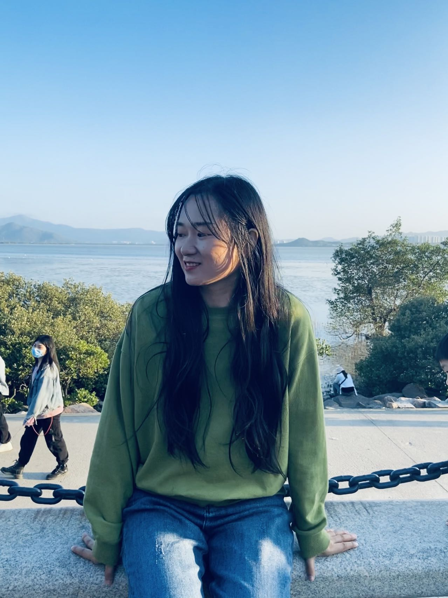
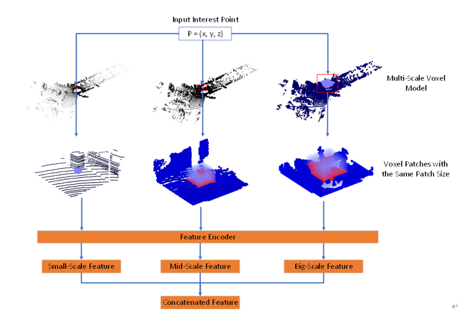
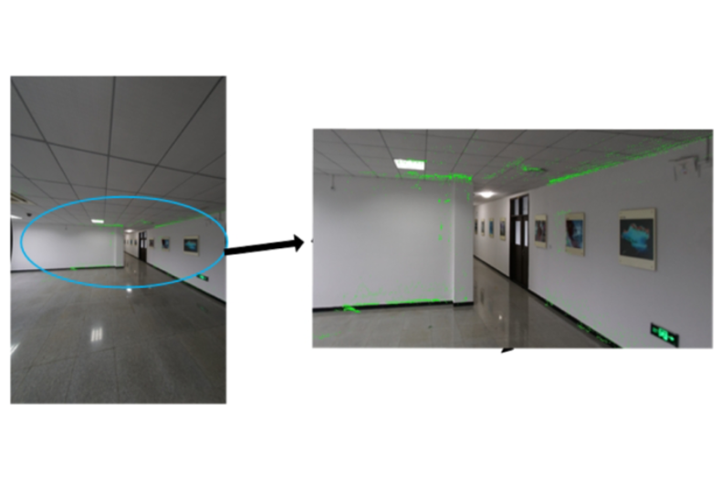
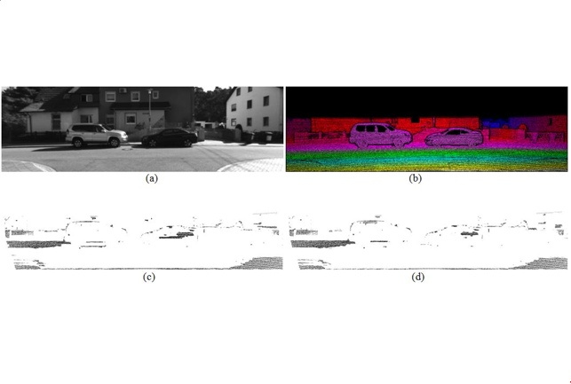
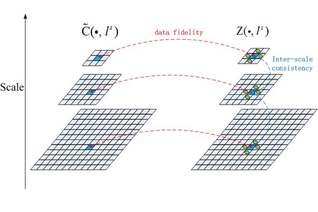
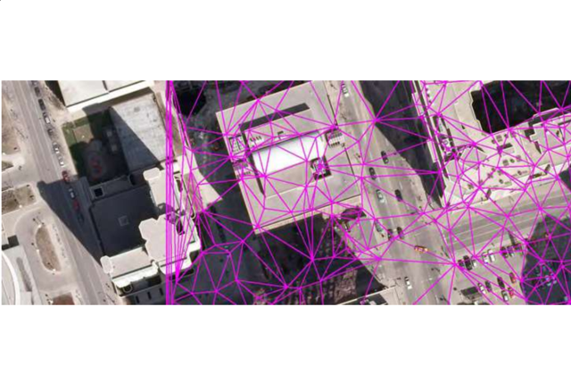
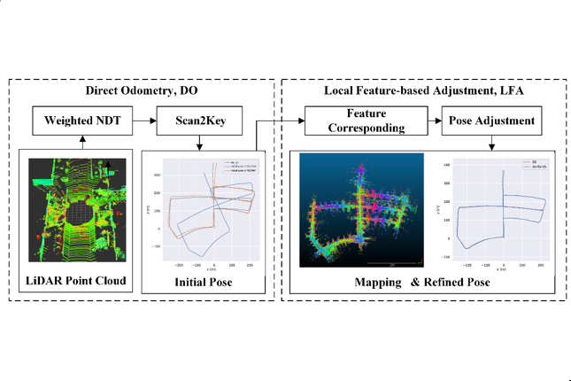
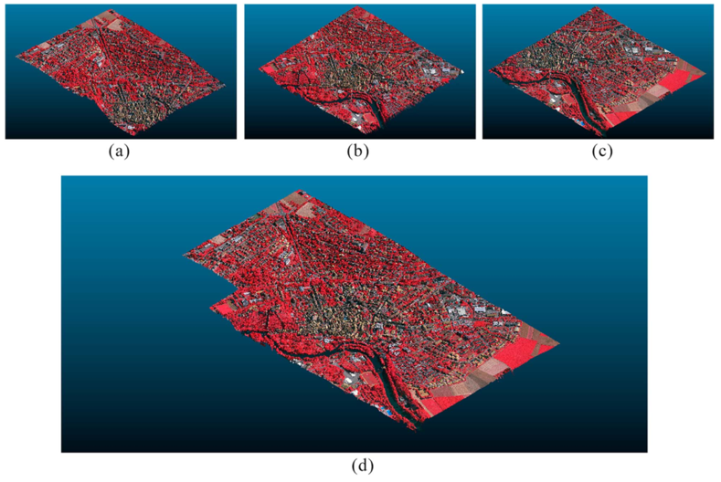

<!--  -->

## Biography

2021.4 - now, I am currently a Postdoctoral researcher at [Visual Computing research Center](https://vcc.tech).
I obtained my Ph.D. degree under supervision of [Prof. Shunyi Zheng](http://jszy.whu.edu.cn/zhengshunyi/en/index.htm) from [School of Remote Sensing and Information Engineering, Wuhan University](http://rsgis.whu.edu.cn/) in 2018. I received my Bachelor degree from [Central China Normal University](https://github.com/fido20160817/haoma.github.io.git) in 2014.

Email: [haoma.whu@gmail.com](haoma.whu@gmail.com)

* * *

## Publications
You can also check my publications from [Google Scholar](https://scholar.google.com/citations?hl=zh-CN&user=zqkEkUoAAAAJ)  

**_3D convolutional auto-encoder based multi-scale feature extraction for point cloud registration_**　　　　　　  
**Hao Ma**, Deyu. Yin, Jingbin Liu, Ruizhi Chen 
_Optics and Laser Technology_, 2022 [Paper](https://doi.org/10.1016/j.optlastec.2022.107860)  

**_A Simple and Efficient Registration of 3D Point Cloud and Image Data for Indoor Mobile Mapping System_**　　　　　　  
**Hao Ma**, Jingbin Liu, Keke Liu, Hongyu Qiu, Dong Xu, Zemin Wang, Xiaodong Gong, Sheng Yang 
_Journal of the Optical Society of America A-Optics Image Science and Vision_, 2021 [Paper](https://doi.org/10.1364/JOSAA.414042)  

**_Confidence-Based Iterative Efficient Large-Scale Stereo Matching_**　　　　　　  
**Hao Ma**, Shunyi Zheng, Yingsong Li, Li Gui, Rongyong Huang, Haitao Wei 
_Cogent Engineering_, 2018 [Paper](https://www.tandfonline.com/doi/full/10.1080/23311916.2018.1427676)  

**_Cross-scale Cost Aggregation Integrating Intrascale Smoothness Constraint with Weighted Lease Squares in Stereo Matching_**  　　　　　　　 
**Hao Ma**, Shunyi Zheng, Chang Li, Yingsong Li, Li Gui, Rongyong Huang 
_Journal of the Optical Society of America A – optics, image science and vision_, 2017 
[Paper](https://doi.org/10.1364/JOSAA.34.000648)  

**_Gaussian mixed model in support of semiglobal matching leveraged by ground control points_**　　　　　　  
**Hao Ma**, Shunyi Zheng, Chang Li, Yingsong Li, Li Gui 
_Journal of Applied Remote Sensing_, 2017 [Paper](https://doi.org/10.1117/1.JRS.11.025014)  

**_NDT-LOAM: A Real-Time Lidar Odometry and Mapping With Weighted NDT and LFA_**　　　　　　  
Shoubin Chen, **Hao Ma**, Changhui Jiang, Baoding Zhou, Weixing Xue 
_IEEE Sensors Journal_, 2022[Paper](https://ieeexplore.ieee.org/document/9664540?source=authoralert)  

**_An Efficient Photogrammetric Stereo Matching Method for High-Resolution Images_**　　　　　　  
Yingsong Li, Shunyi Zheng, Xiaonan Wang, **Hao Ma** 
_Computers & Geosciences_, 2016 [Paper](https://doi.org/10.1016/j.cageo.2016.09.002)  

* * *

## Research Interests
* GAN based semantic image synthesis
* stereo vision
* image and point cloud registration 

If you are interested in my research or my published papers, you can email to me without hesitation. 😀😀
